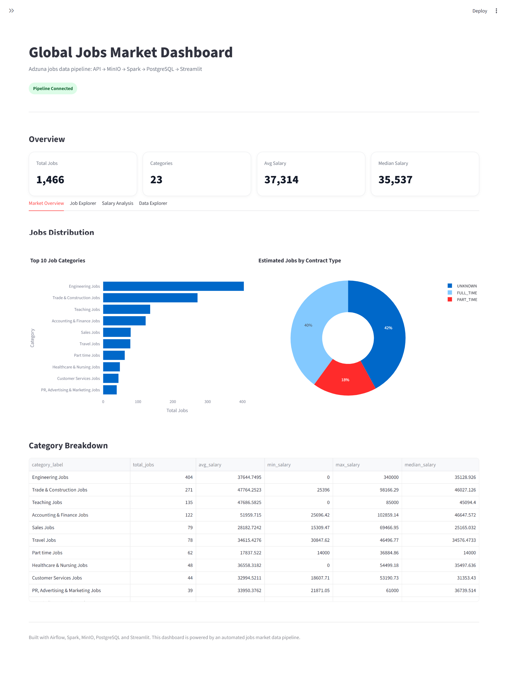

# Global Jobs Market Data Pipeline

An end-to-end data engineering project that collects job market data from the Adzuna API, processes it through a Bronze/Silver/Gold data lake architecture, loads serving-ready datasets into PostgreSQL, orchestrates the workflow with Apache Airflow, and visualizes insights through a Streamlit dashboard.

---

## Overview

This project aims to collect and analyze global job market data to provide insights into job demand, salary distribution, and hiring trends.

The pipeline extracts job postings from the Adzuna API, stores raw data in MinIO, transforms data using Apache Spark, loads curated datasets into PostgreSQL, and serves an interactive Streamlit dashboard.

---

## Architecture


*Note: Notification system (e.g., Discord alerts) is planned for future implementation.*

```text
Adzuna API
   ↓
Python Ingestion
   ↓
MinIO Data Lake
   ├── Bronze: Raw JSON
   ├── Silver: Cleaned job-level data
   └── Gold: Serving-ready datasets
   ↓
PostgreSQL
   ├── jobs_detail
   ├── jobs_summary
   └── salary_analysis
   ↓
Streamlit Dashboard

Airflow orchestrates:
ingestion → processing → database loading
```

---

## Tech Stack

| Layer            | Tools                  |
| ---------------- | ---------------------- |
| Data Source      | Adzuna Jobs API        |
| Ingestion        | Python, Requests       |
| Processing       | Apache Spark, PySpark  |
| Data Lake        | MinIO, S3A             |
| Storage Format   | JSON, Parquet          |
| Serving Database | PostgreSQL             |
| Orchestration    | Apache Airflow         |
| Dashboard        | Streamlit, Plotly      |
| Infrastructure   | Docker, Docker Compose |

---

## Key Features

* API-based batch data ingestion
* Bronze/Silver/Gold Medallion Architecture
* Spark-based data transformation
* Data quality checks for Bronze and Silver layers
* MinIO object storage with S3A integration
* PostgreSQL serving layer
* Airflow orchestration
* Streamlit dashboard with analytics and job exploration
* Fully containerized local data platform

---
## Data Flow Summary

Adzuna API → Raw JSON (Bronze) → Cleaned Data (Silver) → Aggregated Data (Gold)
→ PostgreSQL → Streamlit Dashboard

---

## Data Pipeline

### Bronze Layer

Stores raw API responses in JSON format.

```text
s3a://data-lake/bronze/adzuna/YYYY/MM/DD/
```

### Silver Layer

Stores cleaned and normalized job-level data in Parquet format.

```text
s3a://data-lake/silver/adzuna/jobs/dt=YYYY/MM/DD/
```

### Gold Layer

Stores serving-ready datasets for analytics and dashboard usage.

| Dataset           | Purpose                               |
| ----------------- | ------------------------------------- |
| `jobs_detail`     | Job-level data for Job Explorer       |
| `jobs_summary`    | Aggregated job statistics by category |
| `salary_analysis` | Salary statistics by contract type    |

```text
s3a://data-lake/gold/adzuna/jobs_detail/dt=YYYY/MM/DD/
s3a://data-lake/gold/adzuna/jobs_summary/dt=YYYY/MM/DD/
s3a://data-lake/gold/adzuna/salary_analysis/dt=YYYY/MM/DD/
```

---

## Dashboard


The dashboard enables users to explore job market trends, analyze salary distribution, and search job listings interactively.

The Streamlit dashboard includes:

* Market Overview
* Job Explorer
* Salary Analysis
* Data Explorer
* Search and filters
* Job cards and data tables
* CSV download

---

## Project Structure

```text
global-jobs-market-pipeline/
├── airflow/
├── app/
├── config/
├── core/
├── docker/
├── ingestion/
├── processing/
│   ├── bronze/
│   ├── silver/
│   └── gold/
│
├── quality/
├── storage/
├── requirements/
├── docs/
├── docker-compose.yml
├── .env.example
└── README.md
```

---

## Environment Variables

Create a `.env` file in the project root.

```env
# MinIO
MINIO_ACCESS_KEY=minioadmin
MINIO_SECRET_KEY=minioadmin

# Adzuna API
ADZUNA_APP_ID=your_app_id
ADZUNA_APP_KEY=your_app_key

# PostgreSQL
POSTGRES_USER=postgres
POSTGRES_PASSWORD=your_password
POSTGRES_DB=jobs_market_db
POSTGRES_HOST=postgres
POSTGRES_PORT=5432
```

---

## How to Run

Build and start all services:

```bash
docker compose up -d --build
```

Expected services:

```text
minio
spark
postgres
airflow-webserver
airflow-scheduler
streamlit
```

Service URLs:

| Service       | URL                   |
| ------------- | --------------------- |
| Airflow       | http://localhost:8080 |
| Streamlit     | http://localhost:8501 |
| MinIO Console | http://localhost:9001 |
| PostgreSQL    | http://localhost:5432 |

Ensure Docker is installed and running before starting the services.

---

## Airflow Setup

Initialize Airflow metadata database:

```bash
docker exec -it airflow-webserver airflow db migrate
```

Create an admin user:

```bash
docker exec -it airflow-webserver airflow users create --username admin --password admin --firstname Khang --lastname Le --role Admin --email admin@example.com
```

Trigger the DAG manually:

```bash
docker exec -it airflow-webserver airflow dags test adzuna_jobs_market_pipeline 2026-06-02
```

---

## Future Improvements

- Implement near real-time ingestion using Kafka
- Enhance incremental loading strategy with change tracking
- Add data observability and monitoring (e.g., data freshness, pipeline failures)
- Implement alerting system (Discord or email)
- Optimize query performance with indexing and partitioning

---

## Key Learnings

- Designed and implemented a Medallion Architecture (Bronze/Silver/Gold)
- Built scalable batch data pipelines using Apache Spark
- Managed object storage with MinIO and S3-compatible APIs
- Orchestrated workflows using Apache Airflow
- Ensured data quality across multiple pipeline stages
- Delivered end-to-end data systems from ingestion to visualization

---
## Author

**Khang Le**
Data Engineering Portfolio Project
