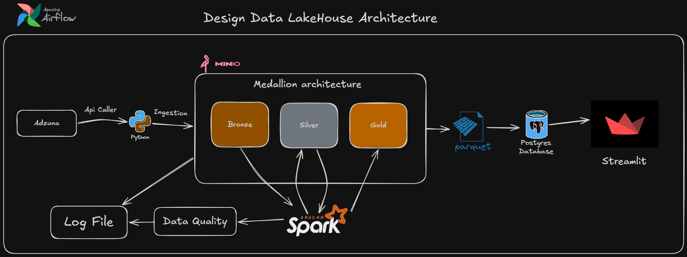

# Global Jobs Market Data Pipeline

## Project Status

Current progress:

✅ API Ingestion  
✅ Bronze Layer (raw data ingestion)  
✅ Bronze Data Quality Checks  
✅ Silver Layer transformation  

🚧 Gold Layer (coming soon)  
🚧 Orchestration with Airflow  
🚧 Data visualization

---

# Architecture



---

# Tech Stack

* Python
* Apache Spark
* Docker
* MinIO (S3-compatible object storage)
* Structured Logging
* Data Quality Validation

---

# Project Structure

```
global-jobs-market-pipeline/

core/
  spark_session.py
  logger.py

ingestion/
  fetcher.py
  batch_builder.py
  writer.py
  run_ingestion.py

processing/
  bronze/
    read_bronze_data.py

  silver/
    write_jobs_silver_parquet.py

quality/
  bronze_quality.py

logs/
  bronze/
  silver/
  api/

docs/
  architecture diagrams

docker/
  container setup
```

---

# Data Architecture

The project uses a **Medallion Architecture** to organize the data pipeline.

## Bronze Layer

The Bronze layer stores **raw ingested data** with minimal processing.

Characteristics:

* Raw API responses
* Stored as JSON
* Partitioned by ingestion date
* Includes metadata such as batch_id and ingestion timestamp

Example storage path:

```
s3a://data-lake/bronze/adzuna/YYYY/MM/DD/
```

Bronze data is not transformed but validated to ensure ingestion integrity.

---

## Bronze Data Quality Checks

Before transforming the data further, a **data quality validation step** runs on the Bronze dataset.

Current checks include:

* Record count validation
* Required column validation
* Records structure validation

Example validations:

* Dataset must not be empty
* Required fields must exist
* Raw records must not be NULL

These checks help detect **ingestion failures and schema issues early in the pipeline**.

---

## Silver Layer

The Silver layer contains **cleaned and structured datasets** derived from Bronze data.

Transformations performed:

* Flatten nested job records
* Normalize job attributes
* Extract important fields such as title, salary, and source
* Store structured datasets in Parquet format

Example output:

```
s3a://data-lake/silver/jobs/
```

Silver data is optimized for **analytics and downstream processing**.

---

# Logging

The pipeline uses **structured logging** to track job execution.

Logs are organized by pipeline component:

```
logs/
  api/
  bronze/
  silver/
  gold/
```

Each pipeline run writes logs containing:

* job start and completion
* dataset statistics
* data quality results
* Spark execution events

This helps with **debugging pipeline failures and monitoring data processing**.

---


# Example Pipeline Flow

1. API ingestion collects job data
2. Raw data stored in Bronze layer
3. Bronze quality checks validate ingestion
4. Spark processes raw data
5. Cleaned data written to Silver layer

---

# Future Improvements

Planned features for the pipeline:

* Gold analytics layer
* Workflow orchestration with Apache Airflow
* Schema drift detection
* Duplicate detection
* Automated data quality reporting
* Dashboard visualization for job market insights

---

# Learning Goals

This project demonstrates key data engineering concepts:

* Building batch data pipelines
* Implementing Medallion architecture
* Using Apache Spark for data transformation
* Designing data quality validation layers
* Implementing structured logging for pipelines

---

# Author

Khang
Data Engineering Portfolio Project

