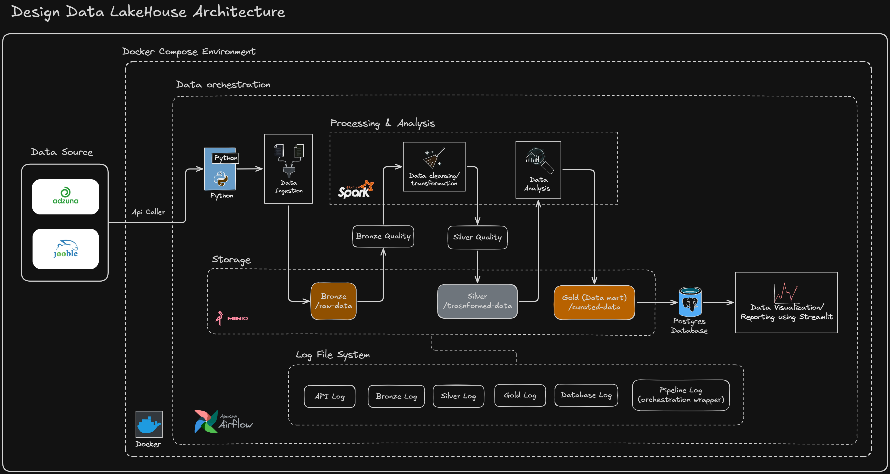
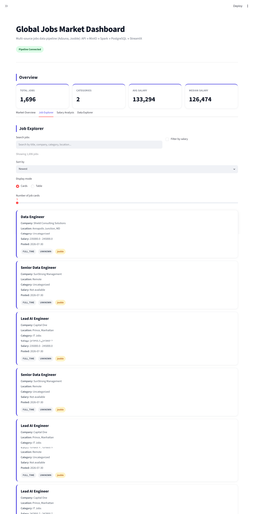

# 🌍 Global Jobs Market Data Platform

An end-to-end **modular data pipeline system** designed to collect, process, validate, and serve global job market data from multiple sources.

This project simulates a **real-world data engineering workflow**, combining batch processing, multi-source schema reconciliation, data quality validation, orchestration, and analytics delivery.

---

## Overview

This project builds a complete data platform to analyze global job market trends, including:

- Job demand distribution
- Salary insights
- Hiring patterns

The system follows a **Medallion Architecture (Bronze → Silver → Gold)** and integrates multiple components:

- Multi-source API ingestion (Adzuna, Jooble)
- Per-source schema normalization
- Distributed data processing (PySpark)
- Data quality validation
- Data warehouse serving layer
- Dashboard visualization

---

## Why This Project

In real-world data systems, raw data is often inconsistent and unreliable — and rarely comes from a single source. This project focuses on building a robust pipeline that ingests from multiple APIs with different schemas and authentication styles, reconciles them into one common schema, and ensures data quality, scalability, and maintainability throughout.

It demonstrates how to design a production-like data platform that can be extended to real-time processing and cloud environments.

---

## Architecture

[](docs/diagram.png)

*Click the diagram to view full resolution.*

```text
Adzuna API ─┐
            ├─> Ingestion Layer (Python) ─> Bronze (raw, per-source)
Jooble API ─┘

Bronze (raw JSON, per-source)
    ↓
Per-source Silver normalizer (schema reconciliation)
    ↓
Unified Silver (cleaned, validated, common schema)
    ↓
Gold (business-ready, aggregated datasets)
    ↓
Serving Layer (PostgreSQL)
    ↓
Streamlit Dashboard

Orchestration: Apache Airflow
```

Each source keeps its own raw structure in Bronze (immutable, replayable). A dedicated normalizer per source maps it into one common schema before Silver's cleaning/validation logic runs — once — on the combined dataset. See [Data Storage Design](#data-storage-design) for exact paths.

---

## System Design Highlights

- **Multi-source ingestion with schema reconciliation**
  Adzuna (query-param auth) and Jooble (POST, key-in-path auth) normalized into one common schema via per-source adapters

- **Modular pipeline architecture**
  Separate ingestion, processing, and quality layers

- **Configuration-driven system**
  YAML-based configuration for flexible pipeline management

- **Structured logging system**
  Per-module logs (API, Bronze, Silver, Gold, Database, Pipeline) tracking both execution and data quality events

- **Data quality validation with severity levels**
  Fail-fast (Bronze) vs monitoring-based (Silver) logic

- **Partitioned data storage**
  Optimized for scalability and query performance

- **Containerized environment**
  Fully reproducible using Docker

- **Automated test suite**
  Unit tests for transform/quality logic, integration tests for real MinIO/Postgres I/O — see [Testing](#testing)

---

## Tech Stack

| Layer            | Tools                  |
|------------------|------------------------|
| Data Sources     | Adzuna API, Jooble API |
| Ingestion        | Python, Requests       |
| Processing       | PySpark                |
| Data Lake        | MinIO (S3A)             |
| Storage Format   | JSON, Parquet           |
| Serving DB       | PostgreSQL              |
| Orchestration    | Airflow                 |
| Visualization    | Streamlit, Plotly       |
| Infrastructure   | Docker                  |
| Testing          | Pytest (unit + integration) |

---

## Key Features

- End-to-end batch data pipeline across multiple sources
- Medallion Architecture (Bronze / Silver / Gold)
- Per-source Silver normalizers reconciling different schemas and auth styles into one common schema
- Source-prefixed job IDs to guarantee uniqueness across sources before deduplication
- PySpark-based data transformation
- Data quality validation at multiple layers
- Structured, per-module logging system
- Airflow-based orchestration
- Partitioned data storage (by date)
- PostgreSQL serving layer
- Interactive Streamlit dashboard with a source filter/badge to compare data across sources
- Fully containerized system
- Unit + integration test suite (Pytest)

---

## Data Flow Summary

```text
Adzuna API, Jooble API
-> Bronze (raw JSON, per-source)
-> Silver normalize (per-source schema mapping)
-> Silver unified (cleaned, validated, common schema)
-> Gold (aggregated datasets)
-> PostgreSQL
-> Dashboard
```

---

## Data Quality

### 🔹 Bronze Layer (Strict Validation)

- Schema validation
- Required fields check
- Empty data prevention

**Fail-fast mechanism applied** — any failed check raises an exception and stops the pipeline immediately. Note: Bronze still lands the raw data regardless — fail-fast halts progression to Silver, it does not block writing to the data lake, preserving a full audit trail for replay/debugging.

---

### 🔹 Silver Layer (Monitoring & Validation)

- Duplicate detection (`job_id`, after source-prefixing)
- Null checks on critical fields
- Salary validation (`salary_min ≤ salary_max`)
- Domain validation (`contract_time`, `contract_type`)

**Severity-based logic:**

- Warning → log and continue
- Critical → stop pipeline

Runs **once** on the unified multi-source dataset, after all per-source normalizers have run and been unioned.

---

### Example Execution Log (Silver Layer Validation)

Here is a snippet from the Spark executor log demonstrating how the pipeline successfully catches data anomalies (such as an invalid salary range) and logs a warning without crashing the entire batch:

<details>
<summary><b>Click to expand Spark Silver Pipeline Log</b></summary>

```text
2026-07-28 08:28:17,245 | INFO | silver.silver_quality | [START] START Silver quality checks
2026-07-28 08:28:23,649 | WARNING | silver.silver_quality | [WARNING] company_name has 19 NULL values
2026-07-28 08:28:24,209 | INFO | silver.silver_quality | [CHECKED] No duplicates found
2026-07-28 08:28:24,944 | WARNING | silver.silver_quality | [WARNING] Found 25 invalid contract_type rows
2026-07-28 08:28:29,382 | INFO | silver.silver_quality | [SUCCESS] Silver quality checks done | rows=1100 | cols=19
```
</details>

Two real integration bugs were caught this way while adding Jooble as a second source: a missing `TEMPORARY` value in the `contract_type` domain list (valid for Jooble, never produced by Adzuna, so the single-source list missed it), and a `posted_at` field dropped during normalization that crashed the Gold layer. Both are documented in [docs/unit-tests.md](docs/unit-tests.md).

---

## Data Storage Design

### Bronze Layer

Stores raw API responses in JSON format, **kept separate per source** — never normalized, so each source's original structure stays replayable.

```text
s3a://data-lake/bronze/adzuna/YYYY/MM/DD/
s3a://data-lake/bronze/jooble/YYYY/MM/DD/
```

### Silver Layer

Stores cleaned, normalized, **unified** job-level data in Parquet format — one dataset covering all sources, distinguished by a `source` column.

```text
s3a://data-lake/silver/jobs/dt=YYYY/MM/DD/
```

### Gold Layer

Stores serving-ready datasets for analytics and dashboard usage, aggregated across all sources.

| Dataset           | Description |
|------------------|-------------|
| jobs_detail      | Job-level dataset (includes `source`, `job_url`) |
| jobs_summary     | Aggregated statistics |
| salary_analysis  | Salary insights |

```text
s3a://data-lake/gold/jobs_detail/dt=YYYY/MM/DD/
s3a://data-lake/gold/jobs_summary/dt=YYYY/MM/DD/
s3a://data-lake/gold/salary_analysis/dt=YYYY/MM/DD/
```

---

## Dashboard



The dashboard enables users to explore job market trends, analyze salary distribution, and search job listings interactively across all integrated sources.

The Streamlit dashboard includes:

* Market Overview
* Job Explorer, with a **Source filter** and per-job source badge (Adzuna / Jooble)
* Salary Analysis
* Data Explorer
* Search and filters
* Job cards and data tables
* CSV download

---

## Testing

The pipeline is covered by an automated Pytest suite, split into two layers:

| Layer | What it checks | Dependencies | Docs |
|---|---|---|---|
| **Unit** | Transform + quality check logic (bronze/silver/gold), fully in-memory | None (local Spark session only) | [docs/unit-tests.md](docs/unit-tests.md) |
| **Integration** | Real read/write against MinIO (S3A) and PostgreSQL (JDBC), across both sources | Docker network (MinIO, Postgres containers running) | [docs/integration-tests.md](docs/integration-tests.md) |

```bash
# Unit tests (run on host or in container, no infra needed)
pytest tests/unit -v

# Integration tests (must run inside the spark container - needs Docker network)
docker compose exec spark pytest tests/integration -v
```

```text
tests/
├── conftest.py                              # shared fixtures (sample data)
├── unit/
│   ├── conftest.py                          # local Spark session + PYSPARK_PYTHON fix
│   ├── test_bronze_quality.py
│   ├── test_silver_transform.py
│   ├── test_silver_quality.py
│   ├── test_gold_summary.py
│   ├── test_gold_salary_analysis.py
│   └── test_gold_jobs_detail.py
└── integration/
    ├── conftest.py                          # Spark session w/ S3A + MinIO/Postgres cleanup fixtures
    ├── test_bronze_read_write_minio.py      # read real bronze JSON, parametrized over [adzuna, jooble]
    ├── test_silver_read_write_minio.py      # seed multi-source bronze -> process_silver -> write -> read back unified, + cross-batch dedup
    ├── test_gold_read_write_minio.py        # write Gold Parquet + read back (round-trip)
    └── test_database_writer_postgres.py     # write to Postgres via JDBC + read back
```

Latest run: **8 passed in ~354s** (`docker compose exec spark pytest tests/integration -v`).

Integration test data is seeded and cleaned up automatically under a fixed dummy date (`9999/01/01`), so the suite is reproducible on a fresh clone without depending on any pre-existing pipeline run. The bronze test is parametrized rather than duplicated per source, and the silver test seeds each source's own raw (non-normalized) schema before running the real `process_silver`/`write_jobs_silver`/`read_silver` functions end to end — verifying the unified, source-prefixed, deduplicated output that the Gold layer and dashboard actually consume.

The docs above also include the real environment debugging journey (Windows PySpark setup, JAR version conflicts, PySpark/Spark runtime mismatch) and two real data-quality/integration bugs found and fixed via testing while adding a second data source.

---

## Project Structure

```text
global-jobs-market-pipeline/
├── airflow/                  # Workflow orchestration
├── app/                      # Streamlit dashboard
├── config/                   # YAML configurations (per-source API config)
├── core/                     # Shared utilities (logger, Spark session)
├── docker/                   # Container setup
├── ingestion/
│   └── sources/               # Per-source fetch logic (Adzuna, Jooble)
├── jars/                     # Extra JDBC/Hadoop-AWS jars (S3A, Postgres)
├── processing/
│   ├── bronze/                # Generic bronze reader (all sources)
│   ├── silver/
│   │   └── normalizers/        # Per-source schema mapping to common schema
│   └── gold/                  # Unified aggregation, source-agnostic
│
├── quality/                  # Data validation logic
├── storage/                  # Data lake and database interaction (MinIO, PostgreSQL)
├── requirements/             # Service-based dependencies (Airflow, Spark, Streamlit, Tests)
├── docs/                     # Diagrams, images, test documentation
├── scripts/                  # Pipeline runners / manual jobs
├── tests/
│   ├── conftest.py           # shared fixtures
│   ├── unit/                 # Logic-only tests, in-memory Spark (bronze/silver/gold)
│   └── integration/          # Real MinIO/Postgres I/O tests, parametrized across sources
├── docker-compose.yml        # Multi-service container orchestration
├── .env.example              # Environment variables template
├── .gitignore
└── README.md
```

---

## Environment Variables

Create a `.env` file in the project root.

```env
# MinIO
MINIO_ACCESS_KEY=minioadmin
MINIO_SECRET_KEY=minioadmin

# Adzuna API
ADZUNA_APP_ID=your_app_id
ADZUNA_APP_KEY=your_app_key

# Jooble API
JOOBLE_API_KEY=your_api_key

# PostgreSQL
POSTGRES_USER=postgres
POSTGRES_PASSWORD=your_password
POSTGRES_DB=jobs_market_db
POSTGRES_HOST=postgres
POSTGRES_PORT=5432
```

---

## How to Run

Build and start all services:

```bash
docker compose up -d --build
```

Expected services:

```text
minio
spark
postgres
airflow-webserver
airflow-scheduler
streamlit
```

Service URLs:

| Service       | URL                   |
| ------------- | --------------------- |
| Airflow       | http://localhost:8080 |
| Streamlit     | http://localhost:8501 |
| MinIO Console | http://localhost:9001 |
| PostgreSQL    | http://localhost:5432 |

Ensure Docker is installed and running before starting the services.

---

## Airflow DAG

```bash
docker exec -it airflow-webserver airflow dags test jobs_market_pipeline 2026-06-02
```

> Update the DAG id above if your DAG file still uses the original `adzuna_jobs_market_pipeline` name.

---

## Future Improvements

- Add more sources (e.g. Arbeitnow, no-auth EU jobs feed — in progress)
- Near real-time pipeline (Kafka)
- Incremental data processing
- Data observability metrics
- Alerting system (Slack/Discord)
- Cloud deployment (AWS/GCP)

---

## Key Learnings

- Designed and implemented a Medallion Architecture (Bronze/Silver/Gold)
- Integrated multiple external APIs with different schemas and authentication
  styles (query-param vs POST + key-in-path) into one common data model via
  a per-source normalizer/adapter pattern
- Built scalable batch data pipelines using Apache Spark
- Managed object storage with MinIO and S3-compatible APIs
- Orchestrated workflows using Apache Airflow
- Ensured data quality across multiple pipeline stages, including domain
  rules that had to evolve as new sources were added
- Delivered end-to-end data systems from ingestion to visualization
- Built and debugged a full Pytest suite (unit + integration), including
  two real bugs found via testing while integrating a second source, and
  a full Docker/JVM/PySpark environment debugging journey

---
## Author

**Khang Le**
Data Engineering Portfolio Project